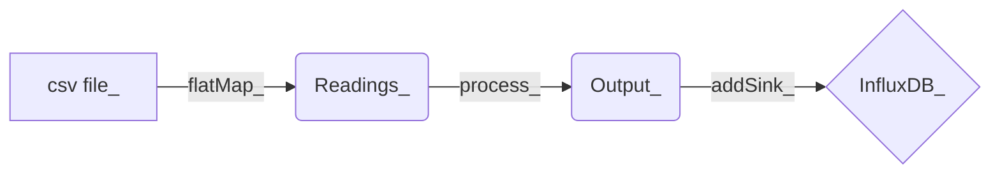

# Flink Anomaly Detection Project

## Objective

This project demonstrates a pipeline for stream processing for anomaly detection.

## Details

This pipeline creates a data stream from a large CSV file. The elements of that data stream are parsed into a Reading object with a timestamp. The elements are then piped through a process which collects them into groups based on their timestamps. Using the elements' readings and the statistical figures of the group, anomaly scores are calculated and added to each individual reading to create new output elements. These output elements containing each reading and its corresponding anomaly score is streamed into a data sink which puts each element into a database.

## Pipeline

Data Stream flow:

## Algorithm: First Approach

The first approach uses static variance multiples to and the interquartile figures from a streaming collection of elements to determine whether each reading is an anomaly.

1. For a sliding window of values
2. Calculate the interquartile range (IQR) for the array
3. Based on the IQR, score the value being processed with the following:
a. If the value is outside of the bounds of the first and third quartile by less then 1.5 * *IQR*, assign 0
b. If the value is outside of the bounds of the first and third quartile by less then 3 * *IQR*, assign .5
c. Else, assign 1

## Algorithm: Second Approach

The second approach ammends the first by making the variance multiples responsive to the.

1. For a sliding window of values
2. Calculate the interquartile range (IQR) for the array
3. Based on the IQR, score the value being processed with the following:
a. If the value is outside of the bounds of the first and third quartile by less then the responsive multiple, *RM* * *IQR*, assign 0
b. If the value is outside of the bounds of the first and third quartile by less then then twice the responsive multiple, *RM* * *IQR*, assign 0.5
c. Else, assign 1

## Database

The DataSink is configured to work with a local infliuxDB database with the following configuration:

location: **localhost**
port: **8086**
username: **admin**
password: **admin**

## Observations

These are some observations about some advantages of each algorithmic approach. The first approach lead to increased redundancy. When readings changed rapidly, each reading was shown to be an anomaly when perhaps subsequent readings were better off being omitted. The second approach perhaps did not determine readings to be anomalies when they should have been.
